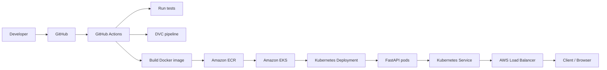

# Movie Sentiment Analysis

A production-oriented machine learning and MLOps project that predicts whether a movie review expresses positive or negative sentiment. The application combines NLP preprocessing, machine learning inference, a FastAPI service, Docker packaging, and cloud deployment workflows designed to move a model from experimentation into a deployable API.


## Project Overview

This repository implements a text-classification system for movie review sentiment analysis. The system accepts raw text input and predicts whether the review is positive or negative using a supervised learning pipeline built around TF-IDF features and a support vector machine classifier.

The project is designed as an end-to-end ML system rather than a notebook-only experiment:

- Data is ingested and split into train/test sets.
- Text is cleaned and normalized with NLP preprocessing.
- TF-IDF features are generated and stored as model artifacts.
- A classifier is trained and evaluated.
- Model metrics are tracked with MLflow.
- The trained artifacts are packaged into a FastAPI app.
- The service is containerized with Docker.
- Deployment automation and Kubernetes manifests target AWS ECR/EKS.

In short, the project covers the full lifecycle: data preparation, ML training, model evaluation, model registry integration, API exposure, containerization, and deployment automation.

## Key Features

- Text preprocessing with lowercasing, URL/email removal, punctuation stripping, tokenization, stopword removal, and lemmatization
- Sentiment classification using a trained TF-IDF + SVC pipeline
- Batch model evaluation with accuracy, precision, recall, and ROC-AUC metrics
- Local model serialization and artifact management
- REST API using FastAPI with HTML and JSON prediction endpoints
- Health and Prometheus metrics endpoints
- Docker-based application packaging
- DVC pipeline for data and model workflow orchestration
- MLflow + DagsHub tracking for experiment and model metadata
- Kubernetes deployment manifest for AWS EKS
- GitHub Actions-based deployment automation defined in the repository
- AWS ECR image publishing workflow described in CI configuration

## Tech Stack

| Category | Technology | Purpose |
| --- | --- | --- |
| Language | Python 3.10 | Core application and ML workflow |
| Data processing | Pandas, NumPy | Data loading, transformation, and feature matrix creation |
| ML / NLP | Scikit-learn | Model training and evaluation |
| NLP | NLTK | Tokenization, stopword filtering, and lemmatization |
| Feature engineering | TF-IDF vectorization | Convert text reviews into numeric features |
| API | FastAPI | Expose prediction endpoints and HTML UI |
| ASGI server | Uvicorn | Serve the FastAPI application within Gunicorn |
| Process manager | Gunicorn | Run the app in the Docker container |
| Containerization | Docker | Package the application and dependencies |
| Cloud registry | Amazon ECR | Store built Docker images |
| Cloud orchestration | Amazon EKS | Run Kubernetes-managed application deployment |
| Orchestration | Kubernetes | Manage Deployment and Service resources |
| CI/CD | GitHub Actions | Automate testing and deployment steps |
| Experiment tracking | MLflow | Log metrics, parameters, and model artifacts |
| Data/model versioning | DVC | Pipeline versioning for training workflow |
| Remote tracking | DagsHub | Remote MLflow/DVC collaboration and artifact storage |
| Monitoring | Prometheus client | Expose metrics endpoint for scraping |
| AWS tooling | AWS CLI, boto3 | AWS authentication and deployment support |

## Machine Learning Pipeline

The project follows a practical ML pipeline implemented across several source modules:

1. Data ingestion
   - `src/data_task/data_ingestion.py` loads the movie review dataset from S3 using AWS credentials and splits it into train/test sets.
   - The dataset is filtered to `positive` and `negative` sentiment labels and converted to numeric targets.

2. Text preprocessing
   - `src/data_task/data_preprocessing.py` cleans each review by converting to lowercase, removing URLs, HTML tags, email addresses, numbers, and punctuation, then tokenizing and removing stopwords before lemmatization.
   - The output is saved under `data/interim/`.

3. Feature extraction / vectorization
   - `src/features/feature_engineering.py` creates TF-IDF features using `TfidfVectorizer` with `ngram_range=(1, 2)` and `stop_words='english'`.
   - The trained vectorizer is saved to `models/vectorizer.pkl` and the transformed train/test data are written to `data/processed/`.

4. Train/test split
   - The train/test split is configured from `params.yaml` with `test_size: 0.25`.

5. Model training
   - `src/model/model_building.py` trains a `sklearn.svm.SVC` classifier with `probability=True` and `random_state=42` on the TF-IDF features.
   - The trained model is serialized to `models/model.pkl`.

6. Model evaluation
   - `src/model/model_evaluation.py` loads the model and test set, computes predictions, and calculates:
     - accuracy
     - precision
     - recall
     - ROC-AUC
   - Results are saved to `reports/metrics.json` and logged to MLflow.

7. Model selection and registration
   - MLflow is configured to log metrics and model artifacts.
   - `src/model/register_model.py` registers the model in the MLflow Model Registry and transitions it to the `Staging` stage when the DagsHub token is present.

8. Inference
   - The FastAPI app loads the serialized vectorizer and model during startup.
   - A user-supplied review is preprocessed with the same pipeline, transformed into TF-IDF features, and passed into the model for prediction.

## Model

### Algorithms and model choice

This project uses:

- `TfidfVectorizer` for text vectorization
- `sklearn.svm.SVC` for binary sentiment classification

The final training script is in `src/model/model_building.py` and trains a SVC model with probability estimates enabled.

### Feature representation

The model operates on TF-IDF features derived from cleaned review text. The vectorizer is configured as:

- `max_features=100`
- `ngram_range=(1, 2)`
- `stop_words='english'`

### Evaluation metrics

The recorded performance from `reports/metrics.json` is:

| Metric | Value |
| --- | --- |
| Accuracy | 0.736 |
| Precision | 0.75 |
| Recall | 0.7016 |
| AUC | 0.7993 |

This is the best recorded performance present in the repository, and it is the basis for the current model artifact.

### Model serialization

- Trained vectorizer: `models/vectorizer.pkl`
- Trained model: `models/model.pkl`
- Metadata: `reports/experiment_info.json`

## NLP Preprocessing

The project performs a clear text-cleaning pipeline before feature engineering.

### Preprocessing details

The actual pipeline implemented in `src/data_task/data_preprocessing.py` does the following:

- Converts text to lowercase
- Removes URLs such as `https://...` and `www...`
- Removes HTML tags
- Removes email addresses
- Removes numbers
- Removes punctuation
- Tokenizes the text with `nltk.word_tokenize`
- Removes stopwords
- Lemmatizes words with `WordNetLemmatizer`
- Joins tokens back into one cleaned review string

### Representative example

Raw text:

```text
OMGGG!!! This movie was soooo AMAZING 😍🔥!!!
```

Processed text:

```text
omggg movie sooo amazing
```

This is consistent with the repository code: lowercase conversion, punctuation removal, stopword removal, and lemmatization are applied, but there is no code here that normalizes repeated characters like `soooo` to `so` or applies spelling correction.

### What happens to each type of text

- Punctuation: removed using `string.punctuation`
- Casing: converted to lowercase
- Stopwords: removed using NLTK English stopwords list
- URLs / usernames / hashtags: URLs are removed; email addresses are removed; there is no custom username/hashtag normalization in the processing code
- Repeated characters: not explicitly collapsed or normalized
- Stemming / lemmatization: lemmatization is used with `WordNetLemmatizer`
- Tokenization: `word_tokenize` is used before stopword filtering and lemmatization

## API

The application exposes a FastAPI service in `app/app.py`.

### Core API behavior

The app loads the trained model and vectorizer at startup and exposes both HTML and JSON endpoints for predictions. It also exposes `/health` and `/metrics` for operational checks.

### Endpoints

| Method | Path | Purpose |
| --- | --- | --- |
| GET | `/` | Serve the HTML UI for entering movie review text |
| POST | `/predict` | Submit review text as a form and render the HTML prediction page |
| POST | `/api/predict` | Submit a JSON payload and receive a structured prediction response |
| GET | `/health` | Return readiness status and artifact loading state |
| GET | `/metrics` | Return Prometheus metrics in the OpenMetrics format |
| GET | `/docs` | Swagger UI |
| GET | `/redoc` | ReDoc UI |
| GET | `/openapi.json` | OpenAPI schema |

### HTML form request

Request:

```http
POST /predict
Content-Type: application/x-www-form-urlencoded

text=This movie was fantastic and very entertaining
```

Response:

- HTML page rendered by the Jinja template
- Contains the prediction label, cleaned text, and status information

### JSON API request

Request:

```http
POST /api/predict
Content-Type: application/json

{
  "text": "I loved this movie. It was exciting and very entertaining."
}
```

Response:

```json
{
  "prediction": "Positive",
  "raw_prediction": "1",
  "cleaned_text": "love movie exciting entertaining"
}
```

The response shape matches the `PredictRequest` model and the code in `app/app.py`.

### Swagger / OpenAPI

Because the app is built with FastAPI, the interactive documentation is available at:

- `/docs`
- `/redoc`
- `/openapi.json`

## Docker

The project includes a Docker image definition in `Dockerfile`.

### Dockerfile details

The repository Dockerfile contains:

```dockerfile
FROM python:3.10-slim

WORKDIR /app

COPY app/ /app/app/
COPY src/ /app/src/
COPY models/ /app/models/
COPY app/requirements.txt /app/requirements.txt

RUN pip install --no-cache-dir -r requirements.txt

RUN python -m nltk.downloader stopwords wordnet punkt punkt_tab

EXPOSE 5000

CMD ["gunicorn", "--bind", "0.0.0.0:5000", "--timeout", "120", "-k", "uvicorn.workers.UvicornWorker", "app.app:app"]
```

### What this means in practice

- Base image: `python:3.10-slim`
- Working directory: `/app`
- Application files copied: `app/`, `src/`, `models/`
- Dependency file copied: `app/requirements.txt`
- Dependencies installed: Python packages from that requirements file
- NLTK resources downloaded: `stopwords`, `wordnet`, `punkt`, and `punkt_tab`
- Exposed port: `5000`
- Runtime: Gunicorn with Uvicorn workers
- App entrypoint: `app.app:app`

### Build and run

Build the image:

```powershell
docker build -t sentiment-analysis:latest .
```

Run the container locally:

```powershell
docker run -p 5000:5000 sentiment-analysis:latest
```

The service is then reachable at:

```text
http://localhost:5000
```

## MLOps

This project implements several MLOps practices using tools that are actually present in the repository.

### DVC

The repository includes `dvc.yaml` and a `dvc.lock` file, which define the machine learning pipeline stages:

- `data_ingestion`
- `data_preprocessing`
- `feature_engineering`
- `model_building`
- `model_evaluation`
- `model_registration`

DVC is used to define stage dependencies and outputs for reproducible data and model workflows. The project notes in `project_flow.txt` also describe using DVC with a local S3-compatible remote and later moving to an AWS S3 remote.

### MLflow

The app and evaluation code configure MLflow tracking to log metrics and models. The repository includes:

- MLflow tracking URI setup
- model metrics logged during evaluation
- model registration into a model registry

The code uses DagsHub-hosted MLflow tracking via the `DAGSHUB_TOKEN` environment variable when it is available.

### DagsHub

DagsHub is used as the remote tracking and collaboration layer for MLflow metadata and artifacts. The repo stores a DagsHub MLflow URL pattern in app configuration and uses `dagshub` in the training and model registration scripts.

### Git and GitHub

The repo is tracked with Git and includes GitHub Actions configuration for CI/CD automation. This is the source-control foundation for the project’s reproducible workflow and deployment pipeline.

### GitHub Actions

The repository includes `.github/workflows/ci.yaml`, which contains the intended automation sequence for checkout, Python setup, dependency installation, DVC execution, tests, Docker build, ECR push, and Kubernetes deployment. The file is currently commented out, which means the workflow is present as configuration but not actively enabled in its current state.

## CI/CD Pipeline

The repository contains the workflow definition at [.github/workflows/ci.yaml](.github/workflows/ci.yaml). The file is commented out, but it clearly defines the intended pipeline sequence.

### Intended pipeline sequence

The defined flow includes:

1. Code checkout using `actions/checkout@v4`
2. Python setup with `actions/setup-python@v5`
3. Dependency installation with `pip install -r requirements.txt`
4. DVC pipeline execution via `dvc repro`
5. Model tests via `python -m unittest tests/test_model.py`
6. Model promotion via `scripts/promote_model.py`
7. FastAPI tests via `python -m unittest tests/test_app.py`
8. AWS authentication for ECR
9. Docker image build and tagging
10. Push to Amazon ECR
11. Kubernetes setup with `kubectl`
12. EKS kubeconfig update
13. Kubernetes secret creation for `DAGSHUB_TOKEN`
14. `kubectl apply -f deployment.yaml`

### Mermaid diagram



> The implemented workflow artifacts are present in the repository, but the specific job bodies in the workflow are commented out as part of the project’s current staging state.

## AWS Deployment

The deployment design targets AWS infrastructure and the repository includes several references to it.

### AWS components used in the project

- Amazon ECR: used to store the built Docker image
- Amazon EKS: used to run the Kubernetes deployment
- Kubernetes `LoadBalancer` Service: exposes the application externally
- IAM / AWS credentials: referenced in project notes and data-ingestion scripts
- AWS CLI and boto3: present in dependency files

### Deployment flow

```text
GitHub
  -> GitHub Actions
  -> Docker image build
  -> Amazon ECR
  -> Amazon EKS
  -> Kubernetes Deployment
  -> Kubernetes Service
  -> AWS Load Balancer
  -> FastAPI API
```

### Actual repository values

The Kubernetes manifest includes this image:

```yaml
image: 423351912836.dkr.ecr.us-east-1.amazonaws.com/sentiment_analysis_proj:latest
```

The CI notes reference a cluster name of `fastapi-cluster` and AWS secrets for:

- `AWS_ACCESS_KEY_ID`
- `AWS_SECRET_ACCESS_KEY`
- `AWS_REGION`
- `AWS_ACCOUNT_ID`
- `ECR_REPOSITORY`

## Kubernetes

The project includes a Kubernetes deployment manifest at `deployment.yaml`.

### Deployment definition

```yaml
apiVersion: apps/v1
kind: Deployment
metadata:
  name: fastapi-app
spec:
  replicas: 2
```

This creates a Deployment with 2 replicas for the FastAPI application. The deployment ensures that the desired number of pods is maintained.

### Pod configuration

The container is configured as:

- Container name: `fastapi-app`
- Container image: `423351912836.dkr.ecr.us-east-1.amazonaws.com/sentiment_analysis_proj:latest`
- Container port: `5000`

### Resources

The pod requests and limits are defined as:

- Requests:
  - CPU: `250m`
  - Memory: `256Mi`
- Limits:
  - CPU: `1`
  - Memory: `512Mi`

### Secrets and environment variables

The deployment reads a Kubernetes secret named `dagshub-secret`:

```yaml
- name: DAGSHUB_TOKEN
  valueFrom:
    secretKeyRef:
      name: dagshub-secret
      key: DAGSHUB_TOKEN
```

### Service and LoadBalancer

A `Service` is defined as:

```yaml
apiVersion: v1
kind: Service
metadata:
  name: fastapi-app-service
spec:
  type: LoadBalancer
  selector:
    app: fastapi-app
  ports:
    - port: 5000
      targetPort: 5000
```

This exposes the application through an AWS-managed load balancer, allowing traffic to reach the FastAPI pods.

### Relationship between resources

- `Deployment` manages the desired number of pods.
- `Pod` runs the application container.
- `Service` provides a stable internal endpoint and load balancing between pods.
- `LoadBalancer` exposes the service externally to clients.

### Useful Kubernetes commands

```powershell
kubectl get pods
kubectl get deployments
kubectl get services
kubectl describe pod <pod-name>
kubectl logs <pod-name>
```

## Monitoring

The project includes a Prometheus metrics endpoint in the FastAPI application, but it does not contain a committed Prometheus configuration file or Grafana dashboard configuration.

### Actual monitoring implementation

The app registers the following counters/histograms:

- `app_request_count`
- `app_request_latency_seconds`
- `model_prediction_count`

The metrics endpoint is exposed at:

```http
GET /metrics
```

This is implemented in `app/app.py` using `prometheus_client` and returns metrics in the Prometheus text format.

### Prometheus notes in the repository

The manual project guide in `project_flow.txt` describes a separate Prometheus setup on an EC2 instance.

This includes:

- Prometheus server on EC2
- `scrape_interval: 15s`
- static targets pointing to the application load balancer or service endpoint
- a `/metrics` target for the FastAPI app

### Grafana

Grafana is not part of the committed repository configuration. The project notes describe a possible EC2-based Grafana setup, but no Grafana configuration files or dashboards are included in the repo.

## Project Architecture

```mermaid
flowchart LR
    User[Client / Browser] --> LB[AWS Load Balancer]
    LB --> SVC[Kubernetes Service]
    SVC --> P1[FastAPI Pod 1]
    SVC --> P2[FastAPI Pod 2]

    P1 --> App[FastAPI App]
    P2 --> App

    App --> Model[Trained SVC model]
    App --> Vectorizer[TF-IDF vectorizer]

    GitHub[GitHub Repository] --> GHA[GitHub Actions]
    GHA --> Tests[Python tests]
    GHA --> Docker[Docker Build]
    Docker --> ECR[Amazon ECR]
    ECR --> EKS[Amazon EKS]
    EKS --> Deployment[Kubernetes Deployment]

    DVC[DVC pipeline] --> Data[Data and model artifacts]
    MLflow[MLflow / DagsHub] --> Metrics[Metrics + experiment tracking]
    App --> MetricsEndpoint[/metrics endpoint]
    MetricsEndpoint --> Prometheus[Prometheus (external setup)]
```

## Project Structure

```text
Movie_Sentiment_Analysis/
├── .dvc/
├── .github/
│   └── workflows/
│       └── ci.yaml
├── app/
│   ├── app.py
│   ├── requirements.txt
│   └── templates/
│       └── index.html
├── data/
│   ├── external/
│   ├── interim/
│   ├── processed/
│   └── raw/
├── docs/
├── local_s3/
├── logs/
├── mlruns/
├── models/
├── notebooks/
├── references/
├── reports/
│   ├── experiment_info.json
│   ├── metrics.json
│   └── figures/
├── scripts/
│   └── promote_model.py
├── src/
│   ├── connections/
│   │   └── s3_connection.py
│   ├── data_task/
│   │   ├── data_ingestion.py
│   │   └── data_preprocessing.py
│   ├── features/
│   │   └── feature_engineering.py
│   ├── logger/
│   ├── model/
│   │   ├── model_building.py
│   │   ├── model_evaluation.py
│   │   ├── predict_model.py
│   │   ├── register_model.py
│   │   └── train_model.py
│   └── visualization/
│       └── visualize.py
├── tests/
│   ├── test_app.py
│   ├── test_aws_credentials.py
│   └── test_model.py
├── .env
├── .dvcignore
├── .gitignore
├── Dockerfile
├── LICENSE
├── Makefile
├── README.md
├── cred.txt
├── deployment.yaml
├── dvc.lock
├── dvc.yaml
├── params.yaml
├── project_flow.txt
├── requirements.txt
├── setup.py
├── test_environment.py
├── tox.ini
└── mlflow.db
```

### Directory purpose

- `app/`: FastAPI application and HTML template
- `src/`: ML pipeline code for ingestion, preprocessing, feature engineering, training, evaluation, and model registration
- `data/`: raw, interim, and processed datasets used by the DVC pipeline
- `models/`: trained model and vectorizer artifacts
- `reports/`: evaluation metrics and experiment metadata
- `tests/`: unit tests for the API and credentials logic
- `scripts/`: helper scripts such as model promotion
- `.github/workflows/`: CI/CD automation definition
- `deployment.yaml`: Kubernetes deployment for the FastAPI app
- `Dockerfile`: production container definition
- `dvc.yaml`: DVC stage pipeline definition
- `project_flow.txt`: project setup notes and deployment documentation

## Installation

The repository is designed for a local Python environment and uses standard Python tooling.

### 1) Clone the repository

```powershell
git clone https://github.com/Santosh-Chapagain/Movie_Sentiment_Analysis.git
cd Movie_Sentiment_Analysis
```

### 2) Create and activate a virtual environment

```powershell
python -m venv .venv
.\.venv\Scripts\Activate.ps1
```

### 3) Install dependencies

```powershell
pip install -r requirements.txt
```

### 4) Download required NLP resources

The code downloads NLTK resources automatically in `src/data_task/data_preprocessing.py` and the Docker image also runs:

```powershell
python -m nltk.downloader stopwords wordnet punkt punkt_tab
```

### 5) Configure environment variables

Set variables locally in a `.env` file or OS environment before running the model or app. At a minimum, these are relevant for deployment and remote tracking:

- `DAGSHUB_TOKEN`
- `MLFLOW_TRACKING_URI`
- `USE_REMOTE_MODEL`
- `AWS_ACCESS_KEY_ID`
- `AWS_SECRET_ACCESS_KEY`
- `AWS_REGION`
- `AWS_DEFAULT_REGION`

### 6) Run the FastAPI application

```powershell
cd app
uvicorn app:app --host 0.0.0.0 --port 8000 --reload
```

Or from the repository root:

```powershell
uvicorn app.app:app --host 0.0.0.0 --port 8000 --reload
```

### 7) Access the API UI

Open in a browser:

```text
http://localhost:8000/docs
```

The home page is also available at:

```text
http://localhost:8000/
```

## Environment Variables

The repository references several environment variables in code and deployment files. Do not commit real secrets or tokens.

| Variable | Purpose | Required |
| --- | --- | --- |
| `DAGSHUB_TOKEN` | Authenticates MLflow/DagsHub tracking and model registry access | Yes for remote tracking |
| `MLFLOW_TRACKING_URI` | Overrides the default DagsHub tracking endpoint | No |
| `USE_REMOTE_MODEL` | Enables MLflow model loading instead of local model loading | No |
| `AWS_ACCESS_KEY_ID` | Used for S3 access and deployment automation | Yes for AWS workflows |
| `AWS_SECRET_ACCESS_KEY` | Used with the AWS access key | Yes for AWS workflows |
| `AWS_REGION` | Region used in AWS ECR/EKS operations | Yes for AWS deployment |
| `AWS_DEFAULT_REGION` | Default AWS region for CLI commands | Recommended |
| `AWS_ACCOUNT_ID` | Used when building the ECR image tag | Yes for ECR push |
| `ECR_REPOSITORY` | Target ECR repository name | Yes for ECR deployment |

Use `.env` files locally and GitHub Secrets / Kubernetes Secrets in production. Never commit secret values to the repo.

## Testing

The repository uses Python's built-in `unittest` framework for core validation.

### Test files

- `tests/test_app.py`
- `tests/test_aws_credentials.py`
- `tests/test_model.py`

### What is tested

- `test_app.py` checks that the home page loads and the prediction endpoint returns either `Positive` or `Negative`.
- `test_aws_credentials.py` validates AWS credential resolution and error handling.
- `test_model.py` interacts with the MLflow and DagsHub model setup logic.

### Run tests locally

```powershell
python -m unittest tests/test_app.py
python -m unittest tests/test_aws_credentials.py
python -m unittest tests/test_model.py
```

The CI workflow notes also reference the following command patterns:

```powershell
python -m unittest tests/test_model.py
timeout 60 python -m unittest tests/test_app.py
```

## API Usage Example

Example request:

```http
POST /api/predict
Content-Type: application/json

{
  "text": "This movie was amazing and the acting was superb. I really enjoyed it."
}
```

Example response:

```json
{
  "prediction": "Positive",
  "raw_prediction": "1",
  "cleaned_text": "movie amazing acting superb enjoyed"
}
```

This demonstrates the real inference path of the service: the review is cleaned, vectorized, and scored by the trained SVC model.

## Deployment Commands

These commands reflect the project configuration and notes present in the repository.

### Docker build and run

```powershell
docker build -t sentiment-analysis:latest .
docker run -p 5000:5000 sentiment-analysis:latest
```

### AWS ECR login and push

```powershell
aws configure set aws_access_key_id $env:AWS_ACCESS_KEY_ID
aws configure set aws_secret_access_key $env:AWS_SECRET_ACCESS_KEY
aws configure set region $env:AWS_REGION
aws ecr get-login-password --region $env:AWS_REGION | docker login --username AWS --password-stdin $env:AWS_ACCOUNT_ID.dkr.ecr.$env:AWS_REGION.amazonaws.com

docker tag sentiment-analysis:latest $env:AWS_ACCOUNT_ID.dkr.ecr.$env:AWS_REGION.amazonaws.com/$env:ECR_REPOSITORY:latest
docker push $env:AWS_ACCOUNT_ID.dkr.ecr.$env:AWS_REGION.amazonaws.com/$env:ECR_REPOSITORY:latest
```

### Kubernetes operations

```powershell
kubectl apply -f deployment.yaml
kubectl get pods
kubectl get deployments
kubectl get services
kubectl logs <pod-name>
```

## Monitoring Commands

The repository exposes a Prometheus metrics endpoint, but it does not include a committed Prometheus configuration file. The project notes describe an external setup using Prometheus on EC2.

Example commands from the project notes:

```bash
/usr/local/bin/prometheus --config.file=/etc/prometheus/prometheus.yml
cat /etc/prometheus/prometheus.yml
curl http://<load-balancer-host>:5000/metrics
```

To validate target health, check the Prometheus UI or verify the target is scraped successfully from the configured endpoint.

## Security Considerations

- Never commit `.env` files containing secrets
- Never commit AWS credentials or access keys
- Never commit DagsHub tokens or GitHub tokens
- Store secrets in GitHub Secrets and Kubernetes Secrets instead of source code
- Use least-privilege IAM policies for ECR/EKS and S3 access
- Restrict AWS security group inbound rules to only required ports
- Use HTTPS/TLS termination in front of the application in production
- Keep image and dependency updates current in a production environment

## Future Improvements

These are realistic next steps for the current system but are not implemented in the repository today:

- Add HTTPS/TLS termination in front of the public API
- Configure a custom domain and certificate
- Add Horizontal Pod Autoscaler (HPA) for dynamic scaling
- Add Grafana dashboards for model and API observability
- Centralize logs with a structured logging stack
- Introduce drift detection for deployment monitoring
- Add automated retraining pipelines based on model performance or data drift
- Move to a transformer-based NLP model such as BERT or DistilBERT
- Add blue/green or canary deployment workflows

## Lessons Learned

This project demonstrates several important engineering and ML concepts:

- NLP preprocessing for real-world text data
- Supervised machine learning for sentiment classification
- Model evaluation using standard classification metrics
- REST API development with FastAPI
- Containerization with Docker
- CI/CD automation through GitHub Actions
- Cloud deployment with AWS ECR and EKS
- Kubernetes orchestration and service exposure
- MLOps foundations using DVC, MLflow, and DagsHub
- Monitoring through the Prometheus-compatible metrics endpoint

## Conclusion

This repository demonstrates a complete machine learning lifecycle for sentiment analysis: raw reviews are ingested, cleaned and vectorized, modeled, evaluated, packaged, and exposed through a production-style API. The project integrates core ML engineering practices with MLOps tooling and cloud deployment workflows, making it a practical portfolio project for data science, machine learning, and MLOps roles.

The full journey is:

```text
Data
-> NLP preprocessing
-> ML training
-> Evaluation
-> Model packaging
-> API
-> Docker
-> CI/CD
-> AWS ECR
-> AWS EKS
-> Kubernetes
-> Load Balancer
-> Monitoring
```
